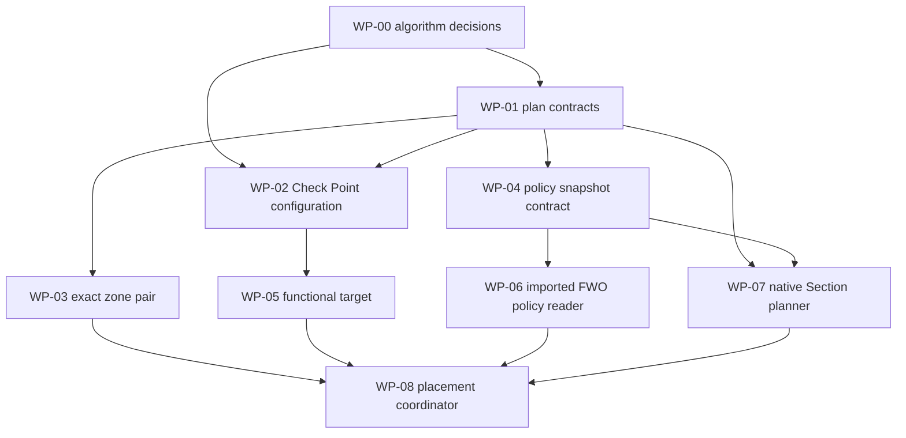

# Check Point firewall rule placement-planning work packages

These notes decompose the positioning algorithm in [`FWO_Regel_Platzierung_Regelwerk.md`](../../../FWO_Regel_Platzierung_Regelwerk.md) into tasks intended to fit one focused agent context each. The current workload ends when FWO can calculate a deterministic **Check Point placement plan** or a typed failure. It does not display or execute that plan.

The design retains narrow extension seams so later teams can add Fortinet, Azure Firewall, or another policy model without replacing the shared input/result contracts. The notes are based on the repository state on `develop` at commit `5ba654343` (2026-09-30); agents must re-check touched code before editing.

## Delivery boundary

This delivery plans the position of **new Check Point access rules only** when the target native Section already exists. It includes:

- hierarchical positioning configuration for Check Point;
- exact source/destination zone validation;
- policy-package, layer, and optional inline-layer resolution;
- a read-only snapshot from the latest acceptable completed FWO import;
- native Section matching;
- a deterministic `position.bottom` plan;
- typed failures for missing, ambiguous, unsupported, or conflicting inputs.

The following are outside this workload:

- writing, publishing, installing, moving, or verifying a rule on Check Point;
- workflow-state changes and multi-firewall execution behavior;
- Implementation-phase preview services and UI;
- address- and service-object display or creation;
- all Fortinet data, importer, API, `global-label`, and placement work;
- all Azure Rule Collection and priority work;
- default end-of-rulebase placement;
- creating missing Check Point Sections;
- modifying or merging existing rules;
- shadowing/effectiveness analysis;
- the broader writing decisions in specification Chapter 12.

Future positioning algorithms are described only in [`FUTURE-VENDOR-EXTENSIONS.md`](FUTURE-VENDOR-EXTENSIONS.md). That file is an interface handoff and is **not an active work package**.

## Final output of this delivery

The public coordinator accepts a new access-rule task and target gateway. It returns exactly one of:

- a placement plan containing the uniquely addressed Check Point package/layer, canonical and matched Section identity, `BottomOfSection`, imported Section boundary, and snapshot fingerprint; or
- a typed failure containing a stable reason and safe diagnostic context.

The plan is descriptive. Producing it must not call a Check Point write endpoint, update workflow state, or persist a claim that the rule was implemented.

## Repository facts that shape the plan

- Hierarchical provisioning settings already exist under `FWO.Data.Provisioning`.
- `ProvisioningPositioningAlgorithm` contains historical options, but no placement implementation consumes them.
- Imported Check Point Sections and inline layers are available through rulebases and `RulebaseLink` records; planning does not connect to Check Point.
- Check Point Sections and inline layers are represented through rulebases and `RulebaseLink` records.
- Path analysis already identifies per-device targets.
- Zone resolution already exists through the middleware compliance-zone service.

## Package dependency graph

## Delivery waves

| Wave | Packages | Outcome |
|---|---|---|
| 0 | WP-00 | Remaining algorithm inputs and compatibility decisions are recorded. |
| 1 | WP-01 to WP-04 | Stable plan/result contracts, configuration, zones, and snapshot model exist. |
| 2 | WP-05 to WP-07 | Check Point policy topology can be resolved, read, and planned without writes. |
| 3 | WP-08 | One callable service returns the complete plan or failure. |

## Common rules for every package

1. Read the source specification, this overview, the applicable ADR, and the package note before changing code.
2. Implement only the package scope. Do not add write, workflow, or UI behavior.
3. Preserve functional precedence: resolve the package/layer first, then find a Section inside it.
4. Never turn a placement failure into a fallback position.
5. Keep the entire pipeline side-effect free apart from read-only FWO configuration, task, zone, and imported-policy queries.
6. Build every Section name centrally as `[DESTINATION-ZONE] < [SOURCE-ZONE]`.
7. Match Section names with trimmed, invariant-uppercase comparison while preserving display spelling.
8. Keep GraphQL and persistence models behind the snapshot-reader adapter.
9. Add focused tests named after a specification scenario or failure reason.
10. An unsupported future method returns a typed failure and performs no policy-snapshot query.

## Shared failure vocabulary

WP-01 owns the final type and identifiers. At minimum support:

- `ConfigurationMissing`
- `PositioningMethodUnknown`
- `PositioningMethodNotImplemented`
- `ZoneResolutionFailed`
- `FunctionalTargetNotFound`
- `FunctionalTargetAmbiguous`
- `PolicyReadFailed`
- `SectionMissing`
- `SectionAmbiguous`
- `SectionOutsideFunctionalTarget`
- `UnsupportedFirewallType`

Every failure carries the management/gateway identity, intended functional target, canonical Section name when available, and a safe human-readable detail. Never retain credentials or complete imported rule content.

## Completion criteria

The workload is complete when one application service can calculate the intended Check Point position without changing external or workflow state. Tests must cover the Check Point-relevant examples in specification Chapter 10: an existing Section, a missing Section, a functional conflict, and an intra-zone flow. Additional tests cover an empty Section, ambiguous package/layer names, duplicate normalized Section names, incomplete policy reads, unsupported methods, and deterministic repeated planning over the same snapshot.
